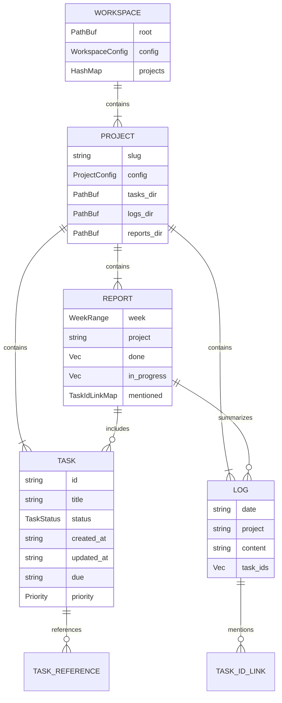

# Data Models: `tt` CLI

**Version:** 1.0  
**Phase:** MVP (v0.1)

---

## Core Entities

### Task

```rust
#[derive(Debug, Clone, Serialize, Deserialize)]
pub struct Task {
    /// Internal version for schema evolution
    pub version: u32,

    /// Unique identifier: "tt-000001"
    pub id: String,

    /// Task title (required)
    pub title: String,

    /// Current status
    pub status: TaskStatus,

    /// Timestamps (ISO-8601 date format: "2026-03-28")
    pub created_at: String,
    pub updated_at: String,

    /// Optional fields
    #[serde(skip_serializing_if = "Option::is_none")]
    pub due: Option<String>,

    #[serde(skip_serializing_if = "Option::is_none")]
    pub started_at: Option<String>,

    #[serde(skip_serializing_if = "Option::is_none")]
    pub done_at: Option<String>,

    #[serde(skip_serializing_if = "Option::is_none")]
    pub priority: Option<Priority>,

    #[serde(skip_serializing_if = "Vec::is_empty", default)]
    pub tags: Vec<String>,

    #[serde(skip_serializing_if = "String::is_empty", default)]
    pub notes: String,

    #[serde(skip_serializing_if = "String::is_empty", default)]
    pub blocked_reason: String,

    #[serde(skip_serializing_if = "Option::is_none")]
    pub estimate: Option<String>,

    /// Git suggestions (auto-generated)
    #[serde(skip_serializing_if = "GitSuggestions::is_empty", default)]
    pub git_suggestions: GitSuggestions,

    /// References to logs/reports (auto-populated)
    #[serde(skip_serializing_if = "Vec::is_empty", default)]
    pub refs: Vec<TaskReference>,

    /// File system path (not serialized)
    #[serde(skip)]
    pub file_path: PathBuf,
}
```

---

### TaskStatus

```rust
#[derive(Debug, Clone, Copy, PartialEq, Eq, Serialize, Deserialize)]
#[serde(rename_all = "lowercase")]
pub enum TaskStatus {
    Todo,
    Doing,
    Done,
    Blocked,
    Canceled,
}

impl TaskStatus {
    /// Validate status transitions
    pub fn can_transition_to(self, target: TaskStatus) -> bool {
        matches!(
            (self, target),
            (Todo, Doing) |
            (Todo, Blocked) |
            (Todo, Canceled) |
            (Doing, Done) |
            (Doing, Blocked) |
            (Doing, Canceled) |
            (Blocked, Doing) |
            (Blocked, Canceled)
        )
    }

    /// Human-readable display
    pub fn display(self) -> &'static str {
        match self {
            TaskStatus::Todo => "TODO",
            TaskStatus::Doing => "DOING",
            TaskStatus::Done => "DONE",
            TaskStatus::Blocked => "BLOCKED",
            TaskStatus::Canceled => "CANCELED",
        }
    }
}
```

---

### Priority

```rust
#[derive(Debug, Clone, Copy, PartialEq, Eq, Serialize, Deserialize)]
pub enum Priority {
    #[serde(rename = "P0")]
    P0,  // Critical
    #[serde(rename = "P1")]
    P1,  // High
    #[serde(rename = "P2")]
    P2,  // Medium (default)
    #[serde(rename = "P3")]
    P3,  // Low
}

impl Default for Priority {
    fn default() -> Self {
        Priority::P2
    }
}
```

---

### TaskReference

```rust
#[derive(Debug, Clone, Serialize, Deserialize)]
pub struct TaskReference {
    /// Reference type: "log", "report", "commit"
    pub kind: ReferenceKind,

    /// Reference value: date, week, hash
    pub value: String,

    /// Optional description
    #[serde(skip_serializing_if = "Option::is_none")]
    pub description: Option<String>,
}

#[derive(Debug, Clone, Serialize, Deserialize)]
#[serde(rename_all = "snake_case")]
pub enum ReferenceKind {
    Log,      // "log:2026-03-28"
    Report,   // "report:2026-W13"
    Commit,   // "commit:abcd1234"
}
```

---

### GitSuggestions

```rust
#[derive(Debug, Clone, Default, Serialize, Deserialize)]
pub struct GitSuggestions {
    #[serde(skip_serializing_if = "String::is_empty", default)]
    pub branch: String,

    #[serde(skip_serializing_if = "String::is_empty", default)]
    pub commit_add: String,

    #[serde(skip_serializing_if = "String::is_empty", default)]
    pub commit_start: String,

    #[serde(skip_serializing_if = "String::is_empty", default)]
    pub commit_done: String,
}

impl GitSuggestions {
    pub fn is_empty(&self) -> bool {
        self.branch.is_empty() &&
        self.commit_add.is_empty() &&
        self.commit_start.is_empty() &&
        self.commit_done.is_empty()
    }
}
```

---

### NewTask (Builder Pattern)

```rust
pub struct NewTask {
    pub title: String,
    pub project: String,
    pub due: Option<String>,
    pub priority: Option<Priority>,
    pub tags: Vec<String>,
    pub notes: Option<String>,
    pub estimate: Option<String>,
}

impl NewTask {
    pub fn builder(title: impl Into<String>) -> Self {
        Self {
            title: title.into(),
            project: String::new(), // Required, set separately
            due: None,
            priority: None,
            tags: Vec::new(),
            notes: None,
            estimate: None,
        }
    }

    pub fn project(mut self, project: impl Into<String>) -> Self {
        self.project = project.into();
        self
    }

    pub fn due(mut self, due: impl Into<String>) -> Self {
        self.due = Some(due.into());
        self
    }

    pub fn priority(mut self, priority: Priority) -> Self {
        self.priority = Some(priority);
        self
    }

    pub fn tag(mut self, tag: impl Into<String>) -> Self {
        self.tags.push(tag.into());
        self
    }

    pub fn notes(mut self, notes: impl Into<String>) -> Self {
        self.notes = Some(notes.into());
        self
    }

    pub fn estimate(mut self, estimate: impl Into<String>) -> Self {
        self.estimate = Some(estimate.into());
        self
    }

    pub fn build(self, id: u64) -> Task {
        let now = chrono::Local::now().format("%Y-%m-%d").to_string();
        let slug = slugify(&self.title);

        Task {
            version: 1,
            id: format!("tt-{:06}", id),
            title: self.title,
            status: TaskStatus::Todo,
            created_at: now.clone(),
            updated_at: now,
            due: self.due,
            started_at: None,
            done_at: None,
            priority: self.priority,
            tags: self.tags,
            notes: self.notes.unwrap_or_default(),
            blocked_reason: String::new(),
            estimate: self.estimate,
            git_suggestions: GitSuggestions {
                branch: format!("{}/tt-{:06}-{}", self.project, id, slug),
                commit_add: format!("task(add): tt-{:06} {}", id, self.title),
                commit_start: format!("task(start): tt-{:06} {}", id, self.title),
                commit_done: format!("task(done): tt-{:06} {}", id, self.title),
            },
            refs: Vec::new(),
            file_path: PathBuf::new(), // Set by storage
        }
    }
}
```

---

## Workspace Entities

### Workspace

```rust
#[derive(Debug, Clone)]
pub struct Workspace {
    /// Root directory path
    pub root: PathBuf,

    /// Root config (tt.toml)
    pub config: WorkspaceConfig,

    /// Loaded projects
    pub projects: HashMap<String, Project>,
}

impl Workspace {
    pub fn load(root: PathBuf) -> Result<Self, WorkspaceError> {
        // Load tt.toml
        // Discover projects/ directory
        // Load each project
    }

    pub fn get_project(&self, name: &str) -> Option<&Project> {
        self.projects.get(name)
    }

    pub fn get_default_project(&self) -> &Project {
        &self.projects[&self.config.default_project]
    }
}
```

---

### WorkspaceConfig

```rust
#[derive(Debug, Clone, Serialize, Deserialize)]
pub struct WorkspaceConfig {
    pub version: u32,

    #[serde(default)]
    pub default_project: String,

    #[serde(default = "default_week_start")]
    pub week_starts_on: String,  // "monday" (fixed for v0.1)

    #[serde(default = "default_task_id_prefix")]
    pub task_id_prefix: String,  // "tt-"

    #[serde(default = "default_task_id_width")]
    pub task_id_width: u32,      // 6

    #[serde(skip_serializing_if = "Option::is_none")]
    pub storage: Option<StorageConfig>,

    #[serde(skip_serializing_if = "Option::is_none")]
    pub reports: Option<ReportsConfig>,

    #[serde(skip_serializing_if = "Option::is_none")]
    pub git: Option<GitConfig>,

    #[serde(skip_serializing_if = "Option::is_none")]
    pub editor: Option<EditorConfig>,
}

fn default_week_start() -> String { "monday".to_string() }
fn default_task_id_prefix() -> String { "tt-".to_string() }
fn default_task_id_width() -> u32 { 6 }
```

---

### Project

```rust
#[derive(Debug, Clone)]
pub struct Project {
    /// Project slug (filesystem name)
    pub slug: String,

    /// Project config
    pub config: ProjectConfig,

    /// Path to project directory
    pub path: PathBuf,

    /// Path to tasks directory
    pub tasks_dir: PathBuf,

    /// Path to logs directory
    pub logs_dir: PathBuf,

    /// Path to reports directory
    pub reports_dir: PathBuf,
}
```

---

### ProjectConfig

```rust
#[derive(Debug, Clone, Serialize, Deserialize)]
pub struct ProjectConfig {
    pub version: u32,
    pub name: String,
    pub slug: String,

    #[serde(skip_serializing_if = "String::is_empty", default)]
    pub description: String,
}
```

---

## Log Entities

### Log

```rust
#[derive(Debug, Clone)]
pub struct Log {
    /// Date (YYYY-MM-DD)
    pub date: String,

    /// Project slug
    pub project: String,

    /// Raw markdown content
    pub content: String,

    /// File system path
    pub file_path: PathBuf,

    /// Extracted task IDs (computed)
    pub task_ids: Vec<String>,
}

impl Log {
    pub fn new(date: NaiveDate, project: &str) -> Self {
        let content = format!(
            r#"# {} ({})

## Highlights
- 

## Done
- 

## Doing
- 

## Blocked
- 

## Notes
- 
"#,
            date.format("%Y-%m-%d"),
            project
        );

        Self {
            date: date.format("%Y-%m-%d").to_string(),
            project: project.to_string(),
            content,
            file_path: PathBuf::new(),
            task_ids: Vec::new(),
        }
    }

    pub fn append(&mut self, text: &str) {
        self.content.push_str("\n");
        self.content.push_str(text);
        self.task_ids = scan_for_task_ids(&self.content);
    }
}
```

---

### TaskIdLinkMap

```rust
/// Maps task IDs to dates they were mentioned
#[derive(Debug, Clone, Default)]
pub struct TaskIdLinkMap {
    /// task_id -> [dates]
    links: HashMap<String, Vec<String>>,
}

impl TaskIdLinkMap {
    pub fn new() -> Self {
        Self { links: HashMap::new() }
    }

    pub fn add(&mut self, task_id: String, date: String) {
        self.links
            .entry(task_id)
            .or_insert_with(Vec::new)
            .push(date);
    }

    pub fn get(&self, task_id: &str) -> Option<&Vec<String>> {
        self.links.get(task_id)
    }

    pub fn dates(&self, task_id: &str) -> Vec<String> {
        self.links
            .get(task_id)
            .map(|dates| {
                let mut sorted = dates.clone();
                sorted.sort();
                sorted
            })
            .unwrap_or_default()
    }

    pub fn all_task_ids(&self) -> Vec<&String> {
        self.links.keys().collect()
    }

    pub fn is_empty(&self) -> bool {
        self.links.is_empty()
    }
}
```

---

## Report Entities

### WeekRange

```rust
#[derive(Debug, Clone)]
pub struct WeekRange {
    pub start: NaiveDate,  // Monday
    pub end: NaiveDate,    // Sunday
    pub iso_week: String,  // "2026-W13"
    pub year: i32,
    pub week: u32,
}

impl WeekRange {
    pub fn from_date(date: NaiveDate) -> Self {
        let weekday = date.weekday();
        let days_since_monday = weekday.num_days_from_monday();
        let start = date - Duration::days(days_since_monday as i64);
        let end = start + Duration::days(6);
        let iso_week = date.iso_week();

        Self {
            start,
            end,
            iso_week: format!("{}-W{:02}", iso_week.year(), iso_week.week()),
            year: iso_week.year(),
            week: iso_week.week(),
        }
    }

    pub fn from_iso_string(iso: &str) -> Option<Self> {
        let re = Regex::new(r"^(\d{4})-W(\d{2})$").ok()?;
        let caps = re.captures(iso)?;
        let year: i32 = caps.get(1)?.as_str().parse().ok()?;
        let week: u32 = caps.get(2)?.as_str().parse().ok()?;

        // Find Monday of that week
        let jan4 = NaiveDate::from_ymd_opt(year, 1, 4)?;
        let mut start = jan4 - Duration::days(jan4.weekday().num_days_from_monday() as i64);
        start = start + Duration::days((week - 1) as i64 * 7);

        Some(Self::from_date(start))
    }

    pub fn contains(&self, date: NaiveDate) -> bool {
        date >= self.start && date <= self.end
    }

    pub fn days(&self) -> Vec<NaiveDate> {
        let mut days = Vec::new();
        let mut current = self.start;
        while current <= self.end {
            days.push(current);
            current = current + Duration::days(1);
        }
        days
    }
}
```

---

### WeeklyReport

```rust
#[derive(Debug, Clone)]
pub struct WeeklyReport {
    pub week: WeekRange,
    pub project: String,

    /// Tasks completed this week (done_at in range)
    pub done: Vec<Task>,

    /// Tasks currently in progress
    pub in_progress: Vec<Task>,

    /// Tasks currently blocked
    pub blocked: Vec<Task>,

    /// Task IDs mentioned in logs (with dates)
    pub mentioned: TaskIdLinkMap,

    /// Task IDs mentioned but no TOML file exists
    pub missing: TaskIdLinkMap,

    /// Extracted highlights by date
    pub highlights: Vec<HighlightDay>,
}

#[derive(Debug, Clone)]
pub struct HighlightDay {
    pub date: String,
    pub items: Vec<String>,
}
```

---

### ReportSummary

```rust
#[derive(Debug, Clone)]
pub struct ReportSummary {
    pub count_done: usize,
    pub count_in_progress: usize,
    pub count_blocked: usize,
    pub count_mentioned: usize,
    pub count_missing: usize,
    pub days_with_logs: usize,
}

impl From<&WeeklyReport> for ReportSummary {
    fn from(report: &WeeklyReport) -> Self {
        Self {
            count_done: report.done.len(),
            count_in_progress: report.in_progress.len(),
            count_blocked: report.blocked.len(),
            count_mentioned: report.mentioned.all_task_ids().len(),
            count_missing: report.missing.all_task_ids().len(),
            days_with_logs: report.highlights.len(),
        }
    }
}
```

---

## Filter Entities

### TaskFilter

```rust
#[derive(Debug, Clone, Default)]
pub struct TaskFilter {
    pub status: Option<Vec<TaskStatus>>,
    pub due_before: Option<NaiveDate>,
    pub due_after: Option<NaiveDate>,
    pub created_before: Option<NaiveDate>,
    pub created_after: Option<NaiveDate>,
    pub tags: Option<Vec<String>>,
    pub priority: Option<Vec<Priority>>,
    pub search: Option<String>,
}

impl TaskFilter {
    pub fn new() -> Self {
        Self::default()
    }

    pub fn status(mut self, status: TaskStatus) -> Self {
        self.status = Some(vec![status]);
        self
    }

    pub fn due_overdue(mut self) -> Self {
        self.due_before = Some(chrono::Local::now().date_naive());
        self
    }

    pub fn due_today(mut self) -> Self {
        let today = chrono::Local::now().date_naive();
        self.due_before = Some(today);
        self.due_after = Some(today);
        self
    }

    pub fn tag(mut self, tag: impl Into<String>) -> Self {
        self.tags
            .get_or_insert_with(Vec::new)
            .push(tag.into());
        self
    }

    pub fn matches(&self, task: &Task) -> bool {
        // Status filter
        if let Some(statuses) = &self.status {
            if !statuses.contains(&task.status) {
                return false;
            }
        }

        // Due date filter
        if let Some(due_before) = self.due_before {
            if let Some(ref due) = task.due {
                if let Ok(due_date) = NaiveDate::parse_from_str(due, "%Y-%m-%d") {
                    if due_date > due_before {
                        return false;
                    }
                }
            }
        }

        // Tag filter (all tags must match)
        if let Some(filter_tags) = &self.tags {
            for filter_tag in filter_tags {
                if !task.tags.contains(filter_tag) {
                    return false;
                }
            }
        }

        // Search filter (title/notes)
        if let Some(ref query) = self.search {
            let query_lower = query.to_lowercase();
            if !task.title.to_lowercase().contains(&query_lower)
                && !task.notes.to_lowercase().contains(&query_lower)
            {
                return false;
            }
        }

        true
    }
}
```

---

## Error Types

### StorageError

```rust
#[derive(Debug, Error)]
pub enum StorageError {
    #[error("Workspace not found at {0}")]
    WorkspaceNotFound(PathBuf),

    #[error("Project '{0}' not found")]
    ProjectNotFound(String),

    #[error("Task '{0}' not found")]
    TaskNotFound(String),

    #[error("Failed to parse TOML: {0}")]
    TomlParseError(#[from] toml_edit::TomlError),

    #[error("IO error: {0}")]
    IoError(#[from] std::io::Error),

    #[error("ID generation failed: {0}")]
    IdGenerationError(String),

    #[error("File lock failed: {0}")]
    LockError(String),
}
```

---

## Schema Evolution

### Version History

| Version | Changes |
|---------|---------|
| 1 | Initial schema (MVP) |

### Migration Strategy

For future schema changes:
1. Add `version` field check during load
2. Implement migration functions
3. Auto-migrate on first load

```rust
impl Task {
    pub fn migrate(mut self) -> Result<Self, MigrationError> {
        match self.version {
            1 => Ok(self), // Current version
            v if v < 1 => {
                // Migration logic for older versions
                self.version = 1;
                Ok(self)
            }
            v => Err(MigrationError::UnknownVersion(v)),
        }
    }
}
```

---

## Relationships Diagram


