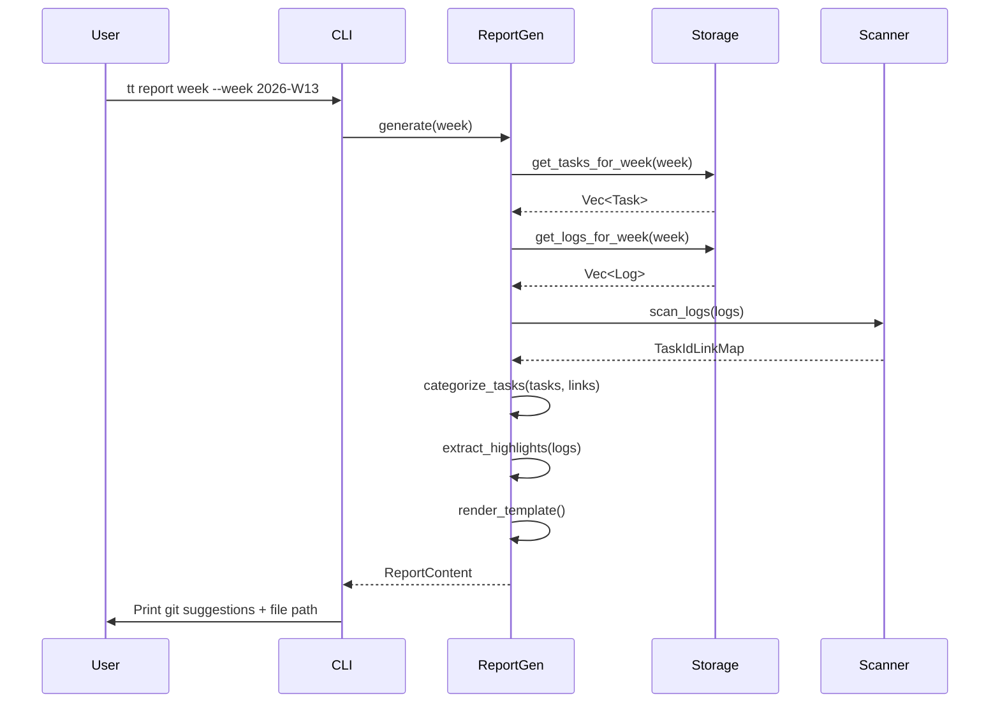
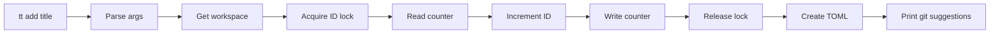
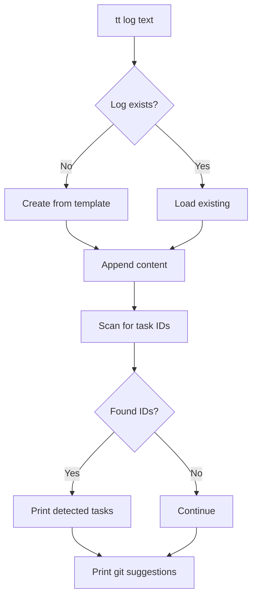
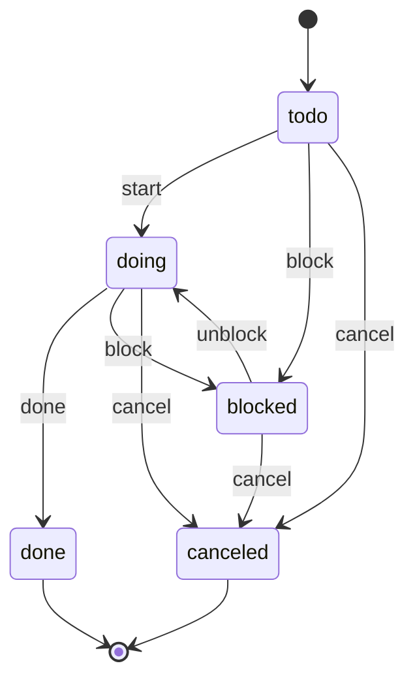
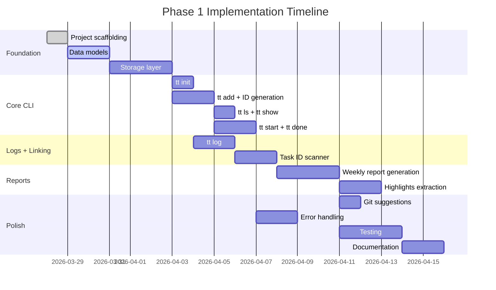

# Phase 1 Design: MVP (v0.1)

**Status:** Draft  
**Created:** 2026-03-28  
**Phase Goal:** A usable CLI for personal task tracking with Git-friendly reports

---

## System Architecture

```mermaid
graph TD
    subgraph CLI Layer
        A[main.rs] --> B[cli::Commands]
        B --> C[cli::add]
        B --> D[cli::ls]
        B --> E[cli::start]
        B --> F[cli::done]
        B --> G[cli::log]
        B --> H[cli::report]
    end

    subgraph Storage Layer
        C --> I[storage::TaskStorage]
        D --> I
        E --> I
        F --> I
        G --> J[storage::LogStorage]
        H --> I
        H --> J
        H --> K[reports::WeeklyReport]
    end

    subgraph Data Layer
        I --> L[TOML Files]
        J --> M[Markdown Files]
        K --> N[Report Templates]
    end

    subgraph Linking
        J --> O[linking::TaskIdScanner]
        O --> P[Regex: tt-d{6}]
        H --> O
    end
```

---

## Component Responsibilities

### 1. CLI Layer (`src/cli/`)

| Module | Responsibility |
|--------|----------------|
| `args.rs` | Clap argument definitions, subcommand enums |
| `commands.rs` | Command implementations (add, ls, start, done, log, report) |
| `format.rs` | Output formatting (tables, colors, git suggestions) |

**Design decisions:**
- CLI layer knows nothing about file formats
- All commands accept `--project` flag (defaults to workspace default)
- `--json` flag for machine-readable output (v0.1 stretch goal)

---

### 2. Storage Layer (`src/storage/`)

| Module | Responsibility |
|--------|----------------|
| `workspace.rs` | Workspace root, project discovery, config loading |
| `task_storage.rs` | Task CRUD, ID generation, file locking |
| `log_storage.rs` | Daily log creation, appending, template management |
| `config.rs` | `tt.toml` and `project.toml` parsing |

**Key interfaces:**
```rust
pub trait TaskStorage {
    fn create(&self, task: NewTask) -> Result<Task, StorageError>;
    fn get(&self, id: TaskId) -> Result<Task, StorageError>;
    fn update(&self, task: Task) -> Result<Task, StorageError>;
    fn list(&self, filter: TaskFilter) -> Result<Vec<Task>, StorageError>;
    fn next_id(&self) -> Result<u64, StorageError>;
}

pub trait LogStorage {
    fn get_or_create(&self, date: NaiveDate) -> Result<Log, StorageError>;
    fn append(&self, date: NaiveDate, content: &str) -> Result<(), StorageError>;
    fn get_for_week(&self, week: WeekRange) -> Result<Vec<Log>, StorageError>;
}
```

---

### 3. Linking Layer (`src/linking/`)

| Module | Responsibility |
|--------|----------------|
| `scanner.rs` | Scan markdown files for task ID patterns |
| `regex_cache.rs` | Compiled regex management (once_cell) |
| `link_map.rs` | Build task_id → [dates] mapping |

**Core algorithm:**
```rust
pub fn scan_log_for_task_ids(content: &str) -> Vec<TaskId> {
    static TASK_ID_REGEX: Lazy<Regex> = Lazy::new(|| {
        Regex::new(r"(?i)\btt-\d{6}\b").unwrap()
    });

    TASK_ID_REGEX
        .find_iter(content)
        .map(|m| m.as_str().to_lowercase())
        .collect::<HashSet<_>>() // Deduplicate
        .into_iter()
        .collect()
}
```

---

### 4. Reports Layer (`src/reports/`)

| Module | Responsibility |
|--------|----------------|
| `weekly.rs` | Weekly report generation logic |
| `templates.rs` | Embedded Jinja2 templates |
| `highlights.rs` | Extract highlights from log sections |

**Report generation flow:**


---

## Data Flow Diagrams

### Task Creation Flow



### Daily Log Flow



---

## Error Handling Strategy

```rust
use thiserror::Error;

#[derive(Error, Debug)]
pub enum TtError {
    #[error("Workspace not initialized. Run 'tt init' first.")]
    WorkspaceNotFound,

    #[error("Project '{0}' not found")]
    ProjectNotFound(String),

    #[error("Task '{0}' not found")]
    TaskNotFound(String),

    #[error("Invalid status transition: {from} → {to}")]
    InvalidStatusTransition { from: String, to: String },

    #[error("Failed to parse TOML: {0}")]
    TomlParseError(#[from] toml_edit::TomlError),

    #[error("IO error: {0}")]
    IoError(#[from] std::io::Error),

    #[error("Template error: {0}")]
    TemplateError(#[from] minijinja::Error),
}

pub type Result<T> = std::result::Result<T, TtError>;
```

**Error display guidelines:**
- User-facing errors: clear, actionable messages
- Include suggestions where possible ("Run `tt init` first")
- Debug output with `RUST_LOG=debug` for troubleshooting

---

## File Format Specifications

### Task File (`tt-000001.toml`)

```toml
version = 1
id = "tt-000001"
title = "Refactor config loader"
status = "todo"  # todo | doing | done | blocked | canceled

created_at = "2026-03-28"
updated_at = "2026-03-28"

# Optional fields
due = "2026-04-03"
started_at = ""
done_at = ""
priority = "P2"  # P0 | P1 | P2 | P3
tags = ["rust", "cli"]
notes = ""
blocked_reason = ""
estimate = "2h"

[git_suggestions]
branch = "work/tt-000001-refactor-config-loader"
commit_add = "task(add): tt-000001 Refactor config loader"
commit_start = "task(start): tt-000001 Refactor config loader"
commit_done = "task(done): tt-000001 Refactor config loader"
```

### Daily Log (`2026-03-28.md`)

```markdown
# 2026-03-28 (work)

## Highlights
- tt-000001: Initial implementation

## Done
- 

## Doing
- tt-000001: Refactor config loader

## Blocked
- 

## Notes
- Discussed approach with team.
```

### Weekly Report (`2026-W13.md`)

```markdown
# Weekly Report — 2026-W13 (work)
Range: 2026-03-23 to 2026-03-29

## Summary
- Done (by done_at): 1
- In progress (current status): 0
- Blocked (current status): 0
- Mentioned in logs: 1
- Missing tasks referenced in logs: 0

## Done
- tt-000001 — Refactor config loader

## In Progress
- (none)

## Blocked
- (none)

## Mentioned in Logs
- tt-000001 — Mentioned on: 2026-03-28

## Missing tasks referenced in logs
- (none)

## Worklog Highlights
### 2026-03-28
- tt-000001: Initial implementation
```

---

## Status Transition Rules



**Validation logic:**
```rust
impl TaskStatus {
    pub fn can_transition_to(self, target: TaskStatus) -> bool {
        matches!(
            (self, target),
            (Todo, Doing) |
            (Todo, Blocked) |
            (Todo, Canceled) |
            (Doing, Done) |
            (Doing, Blocked) |
            (Doing, Canceled) |
            (Blocked, Doing) |
            (Blocked, Canceled)
        )
    }
}
```

---

## Week Calculation (Monday Start)

```rust
use chrono::{Datelike, NaiveDate, Duration};

pub struct WeekRange {
    pub start: NaiveDate,  // Monday
    pub end: NaiveDate,    // Sunday
    pub iso_week: String,  // "2026-W13"
}

impl WeekRange {
    pub fn from_date(date: NaiveDate) -> Self {
        let weekday = date.weekday();
        let days_since_monday = weekday.num_days_from_monday();
        let start = date - Duration::days(days_since_monday as i64);
        let end = start + Duration::days(6);
        let iso_week = format!("{}-W{:02}", start.year(), start.iso_week().week());

        Self { start, end, iso_week }
    }

    pub fn from_iso_string(iso: &str) -> Option<Self> {
        // Parse "2026-W13" format
        let re = Regex::new(r"^(\d{4})-W(\d{2})$").ok()?;
        let caps = re.captures(iso)?;
        let year: i32 = caps.get(1)?.as_str().parse().ok()?;
        let week: u32 = caps.get(2)?.as_str().parse().ok()?;

        // Find Monday of that week
        let jan4 = NaiveDate::from_ymd_opt(year, 1, 4)?;
        let mut start = jan4 - Duration::days(jan4.weekday().num_days_from_monday() as i64);
        start = start + Duration::days((week - 1) as i64 * 7);

        Some(Self::from_date(start))
    }
}
```

---

## Git Suggestions Format

```rust
pub struct GitSuggestion {
    pub branch: String,
    pub commit_message: String,
    pub files_changed: Vec<String>,
}

impl GitSuggestion {
    pub fn for_task_add(task: &Task, project: &str) -> Self {
        let slug = slugify(&task.title);
        Self {
            branch: format!("{}/tt-{:06}-{}", project, task.id, slug),
            commit_message: format!("task(add): tt-{:06} {}", task.id, task.title),
            files_changed: vec![task.file_path.clone()],
        }
    }

    pub fn display(&self) -> String {
        format!(
            r#"
Git suggestions (not executed):
  Suggested branch: {}
  Suggested commit: {}
  Files changed:
{}

  git add -A
  git checkout -b {}
  git commit -m "{}"
"#,
            self.branch,
            self.commit_message,
            self.files_changed.iter().map(|f| format!("    - {}", f)).collect::<Vec<_>>().join("\n"),
            self.branch,
            self.commit_message,
        )
    }
}
```

---

## Testing Strategy

### Unit Tests
- ID generation (no collisions)
- Week range calculation (edge cases: year boundaries)
- Status transition validation
- Task ID regex extraction

### Integration Tests
- Full CLI workflow: `init → add → start → done → log → report`
- Multi-project workspace
- Manual edit handling (malformed TOML)

### Snapshot Tests (insta)
- `tt --help` output
- `tt ls` formatting
- Weekly report output (deterministic)
- Git suggestion messages

**Example snapshot test:**
```rust
#[test]
fn test_weekly_report_output() {
    let workspace = create_test_workspace();
    let report = generate_weekly_report(&workspace, "2026-W13").unwrap();

    insta::assert_snapshot!(report, @r###"
    # Weekly Report — 2026-W13 (work)
    Range: 2026-03-23 to 2026-03-29

    ## Summary
    - Done (by done_at): 1
    ...
    "###);
}
```

---

## Implementation Order



---

## Open Questions

### Q1: Editor Integration for `tt log --edit`

**Options:**
- A) Use `$EDITOR` env var (Unix standard)
- B) Use `editors` crate (cross-platform detection)
- C) Config file setting (`tt.toml` editor path)

**Recommendation:** A + B fallback
```rust
fn get_editor() -> Option<String> {
    std::env::var("EDITOR")
        .ok()
        .or_else(|| editors::detect().map(|e| e.to_string()))
}
```

---

### Q2: Task ID Width Configuration

**Current spec:** Fixed 6 digits (`tt-000001`)

**Should this be configurable?**
- Config option: `task_id_width = 6` in `tt.toml`
- Trade-off: Flexibility vs. complexity

**Recommendation for v0.1:** Fixed width (6 digits = up to 999,999 tasks per project)

---

### Q3: Report Template Customization

**Options:**
- A) Hardcoded template (simplest)
- B) External template file (`templates/weekly.j2`)
- C) Config-embedded template string

**Recommendation for v0.1:** A (hardcoded)
**Recommendation for v0.3:** B (external templates)

---

### Q4: Handling Deleted Tasks

**Scenario:** User manually deletes `tt-000001.toml`, but logs still reference it.

**Options:**
- A) Report shows "Missing tasks" section (current spec)
- B) Warn during report generation
- C) Keep a "tombstone" record

**Recommendation:** A + B (show in report, warn during generation)

---

## Decisions Summary

| Decision | Choice | Rationale |
|----------|--------|-----------|
| D1.1: CLI Framework | `clap` 4.5 derive | Industry standard, excellent UX |
| D1.2: TOML Library | `toml_edit` 0.22 | Preserves comments/format |
| D1.3: Week Start | Monday (fixed) | ISO-8601 compliant |
| D1.4: Task ID Width | 6 digits (fixed) | Simple, sufficient for personal use |
| D1.5: Git Integration | Suggestions only | User control, no surprises |
| D1.6: Report Template | Hardcoded (v0.1) | Reduce complexity for MVP |
| D1.7: Editor Detection | `$EDITOR` + fallback | Unix standard + cross-platform |
| D1.8: File Locking | `fs2` exclusive | Simple, prevents corruption |

---

## Next Steps

1. **Review this design** — Confirm all decisions align with requirements
2. **Approve or iterate** — Provide feedback on open questions
3. **Run `/gsd:plan-phase 1`** — Generate atomic implementation tasks
