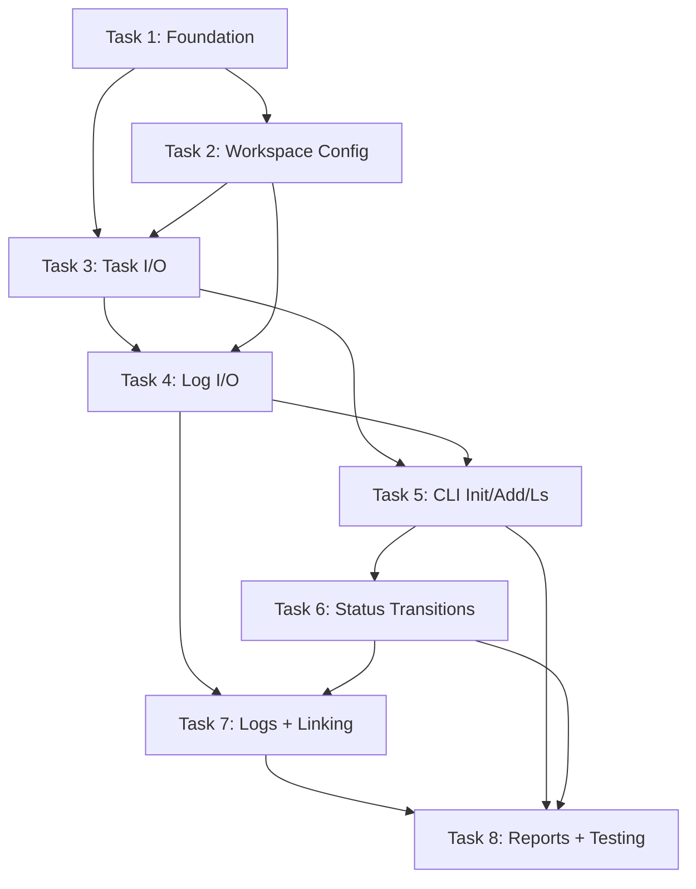

# Plan: Phase 1 MVP Implementation

**Phase:** 01-mvp  
**Status:** Ready for execution  
**Created:** 2026-03-28  
**Total Tasks:** 8 atomic tasks (grouped in waves)

---

## Atomic Tasks

### Task 1: Project Scaffolding + Foundation

**Goal:** Create Rust project structure with all dependencies and core data models.

**Subtasks:**
1.1. Initialize Rust project with `cargo init`
1.2. Create `Cargo.toml` with v0.1 dependencies (clap, toml_edit, chrono, etc.)
1.3. Create module structure: `src/error.rs`, `src/models/`, `src/storage/`, `src/cli/`, `src/linking/`, `src/reports/`
1.4. Implement data models: `Task`, `TaskStatus`, `Priority`, `NewTask` builder
1.5. Implement error types: `TtError`, `StorageError` with `thiserror`
1.6. Implement `WeekRange` struct with Monday-start week calculation

**Files to create:**
- `Cargo.toml`
- `src/lib.rs`, `src/main.rs`
- `src/error.rs`
- `src/models/mod.rs`, `src/models/task.rs`, `src/models/week.rs`
- `src/storage/mod.rs`
- `src/cli/mod.rs`
- `src/linking/mod.rs`
- `src/reports/mod.rs`

**Acceptance Criteria:**
- [ ] `cargo build` compiles without errors
- [ ] `cargo clippy` produces no warnings
- [ ] `TaskStatus::can_transition_to()` has unit tests for all transitions
- [ ] `WeekRange::from_date()` correctly calculates Monday start for any date
- [ ] `WeekRange::from_date()` handles edge cases (year boundaries, ISO week 1/52)

**Verification Commands:**
```bash
cargo build
cargo clippy -- -D warnings
cargo test models::task::tests
cargo test models::week::tests
```

---

### Task 2: Storage Layer - Workspace + Config

**Goal:** Enable loading workspace configuration and discovering projects.

**Subtasks:**
2.1. Implement `WorkspaceConfig` and `ProjectConfig` structs with TOML deserialization
2.2. Implement `Workspace::load()` to load `tt.toml` and discover projects
2.3. Implement project discovery: scan `projects/` directory for `project.toml` files
2.4. Implement `Project` struct with path resolution (tasks_dir, logs_dir, reports_dir)

**Files to create/modify:**
- `src/models/config.rs` (or extend `src/models/mod.rs`)
- `src/storage/workspace.rs`
- `src/storage/mod.rs` (export workspace module)

**Acceptance Criteria:**
- [ ] `Workspace::load()` correctly loads `tt.toml` with all config fields
- [ ] `Workspace::load()` errors with clear message if `tt.toml` missing
- [ ] Project discovery finds all `project.toml` files in `projects/` subdirectory
- [ ] `Project` struct correctly resolves `tasks/`, `logs/`, `reports/` paths
- [ ] Manual test: Create sample `tt.toml` + `projects/work/project.toml`, verify workspace loads

**Verification Commands:**
```bash
cargo build
cargo test storage::workspace::tests
# Manual test
mkdir -p test_workspace/projects/work
# Create tt.toml and project.toml, then test loading
```

---

### Task 3: Storage Layer - Task File I/O + ID Generation

**Goal:** Read/write task files with atomic ID generation using file locking.

**Subtasks:**
3.1. Implement `TaskStorage::create()` to write task TOML files
3.2. Implement `TaskStorage::get()` to read task TOML files
3.3. Implement `TaskStorage::update()` to modify existing tasks
3.4. Implement `TaskStorage::list()` with filtering support
3.5. Implement ID generation with `fs2` file locking (counter file approach)
3.6. Implement `toml_edit` for preserving comments/format on manual edits

**Files to create/modify:**
- `src/storage/task.rs`
- `src/storage/id_generator.rs` (or extend `src/storage/task.rs`)

**Acceptance Criteria:**
- [ ] `TaskStorage::create()` writes valid TOML with all fields
- [ ] `TaskStorage::get()` parses task file with robust error handling
- [ ] `TaskStorage::update()` preserves file formatting (uses `toml_edit`)
- [ ] `next_id()` generates incremental IDs with no collisions
- [ ] Concurrent `next_id()` calls (tested with threads) don't produce duplicates
- [ ] Malformed TOML produces helpful error message (not panic)

**Verification Commands:**
```bash
cargo build
cargo test storage::task::tests
cargo test storage::id_generator::tests
# Concurrent test
cargo test storage::id_generator::tests::test_concurrent_id_generation -- --ignored
```

---

### Task 4: Storage Layer - Log File I/O + Template

**Goal:** Create/append daily log files with default template.

**Subtasks:**
4.1. Implement `Log` struct with content management
4.2. Implement `LogStorage::get_or_create()` to load or create daily log
4.3. Implement `LogStorage::append()` to add content to log
4.4. Implement default log template (Highlights, Done, Doing, Blocked, Notes sections)
4.5. Implement log file path resolution: `logs/YYYY/YYYY-MM-DD.md`

**Files to create/modify:**
- `src/storage/log.rs`

**Acceptance Criteria:**
- [ ] `Log::new()` creates log with correct default template
- [ ] `LogStorage::get_or_create()` loads existing log or creates new one
- [ ] `LogStorage::append()` adds content without overwriting existing content
- [ ] Log file path follows `logs/YYYY/YYYY-MM-DD.md` pattern
- [ ] Template includes all required sections with markdown list format

**Verification Commands:**
```bash
cargo build
cargo test storage::log::tests
# Manual test: create log, append content, verify file
```

---

### Task 5: CLI Commands - Init + Add + List

**Goal:** Implement core CLI commands for workspace initialization and task creation.

**Subtasks:**
5.1. Set up `clap` CLI structure with subcommand enum
5.2. Implement `tt init` command: create workspace structure + sample files
5.3. Implement `tt add <title>` command: create task with auto-generated ID
5.4. Implement `tt ls` command: list tasks by status (plain text formatting)
5.5. Implement `tt show <id>` command: display task details
5.6. Add `--project` flag to all commands (defaults to workspace default)

**Files to create/modify:**
- `src/cli/args.rs` (clap definitions)
- `src/cli/commands.rs` (command implementations)
- `src/cli/format.rs` (output formatting)
- `src/main.rs` (CLI dispatch)

**Acceptance Criteria:**
- [ ] `tt --help` shows all subcommands with descriptions
- [ ] `tt init` creates `tt.toml`, `projects/work/`, sample task, sample log, sample report
- [ ] `tt add "Test task"` creates `tt-000001.toml` with correct fields
- [ ] `tt ls` displays tasks grouped by status (TODO, DOING, DONE, BLOCKED, CANCELED)
- [ ] `tt show tt-000001` displays all task fields in readable format
- [ ] All commands accept `--project` flag
- [ ] Commands print git suggestions after successful execution

**Verification Commands:**
```bash
cargo build
cargo test cli::commands::tests::test_init
cargo test cli::commands::tests::test_add
cargo insta test  # Snapshot tests for --help, ls output
# Manual test
tt init
tt add "Refactor config loader"
tt ls
tt show tt-000001
```

---

### Task 6: CLI Commands - Status Transitions

**Goal:** Implement task lifecycle commands with validation.

**Subtasks:**
6.1. Implement `tt start <id>` command: transition to `doing`, set `started_at`
6.2. Implement `tt done <id>` command: transition to `done`, set `done_at`
6.3. Implement status transition validation (`can_transition_to` logic)
6.4. Add timestamp updates (`updated_at` on every change, `started_at`/`done_at` on transition)
6.5. Add clear error messages for invalid transitions

**Files to create/modify:**
- `src/cli/commands.rs` (add start/done commands)
- `src/models/task.rs` (ensure `started_at`, `done_at` fields exist)

**Acceptance Criteria:**
- [ ] `tt start tt-000001` sets status to `doing` and `started_at` to current date
- [ ] `tt done tt-000001` sets status to `done` and `done_at` to current date
- [ ] `tt start` on already-done task returns error: "Cannot start task: already done"
- [ ] `tt done` on todo task returns error with suggestion: "Start task first with `tt start`"
- [ ] `updated_at` is updated on every change
- [ ] Commands print git suggestions after successful execution

**Verification Commands:**
```bash
cargo build
cargo test models::task::tests::test_can_transition_to
cargo test cli::commands::tests::test_start
cargo test cli::commands::tests::test_done
# Manual test
tt init
tt add "Test task"
tt start tt-000001
tt show tt-000001  # Verify started_at
tt done tt-000001
tt show tt-000001  # Verify done_at
```

---

### Task 7: Logs + Auto-Linking

**Goal:** Enable daily logging with automatic task ID detection.

**Subtasks:**
7.1. Implement `tt log <text>` command: append to today's log
7.2. Implement `tt log --edit` command: open log in `$EDITOR`
7.3. Implement task ID scanner with regex `tt-\d{6}` (using `once_cell` cache)
7.4. Implement auto-linking detection: print detected task IDs after log append
7.5. Implement `TaskIdLinkMap` for building task_id → [dates] mapping

**Files to create/modify:**
- `src/cli/commands.rs` (add log command)
- `src/linking/scanner.rs` (regex scanning logic)
- `src/linking/regex.rs` (compiled regex cache)
- `src/models/link.rs` (TaskIdLinkMap struct)

**Acceptance Criteria:**
- [ ] `tt log "Worked on tt-000001"` creates/appends log file
- [ ] Log file follows `logs/YYYY/YYYY-MM-DD.md` path pattern
- [ ] Command prints: "Detected task IDs: tt-000001"
- [ ] `tt log --edit` opens editor from `$EDITOR` env var (or platform default)
- [ ] `scan_for_task_ids()` extracts all `tt-000001` patterns from text
- [ ] `scan_for_task_ids()` deduplicates repeated IDs
- [ ] `TaskIdLinkMap` correctly maps task IDs to dates

**Verification Commands:**
```bash
cargo build
cargo test linking::scanner::tests
cargo test linking::regex::tests
# Manual test
tt init
tt log "Worked on tt-000001: initial implementation"
tt log "Multiple: tt-000001 and tt-000002"
cat projects/work/logs/2026/2026-03-28.md
```

---

### Task 8: Weekly Reports + Testing + Documentation

**Goal:** Generate weekly reports and complete testing/documentation.

**Subtasks:**
8.1. Implement `tt report week` command: generate weekly report
8.2. Implement report sections: Done, In Progress, Blocked, Mentioned, Missing, Highlights
8.3. Implement highlights extraction from log sections (Highlights, Done, Doing, Notes)
8.4. Implement missing task detection: warn if log references non-existent task
8.5. Implement unit tests: ID generation, week calculation, status transitions, regex
8.6. Implement integration tests: full CLI workflow
8.7. Implement snapshot tests with `insta`: `tt --help`, `tt ls`, weekly report
8.8. Write README with quickstart (< 5 minutes)
8.9. Write CHANGELOG.md

**Files to create/modify:**
- `src/reports/weekly.rs` (report generation logic)
- `src/reports/highlights.rs` (highlights extraction)
- `src/reports/template.rs` (embedded template)
- `tests/cli_tests.rs` (integration tests)
- `README.md`
- `CHANGELOG.md`

**Acceptance Criteria:**
- [ ] `tt report week` generates report for current week
- [ ] `tt report week --week 2026-W13` generates report for specific week
- [ ] Report includes all required sections: Done, In Progress, Blocked, Mentioned, Missing, Highlights
- [ ] Report correctly identifies tasks with `done_at` in week range
- [ ] Report warns about missing tasks referenced in logs
- [ ] Highlights extraction correctly parses markdown sections
- [ ] `cargo test` passes all tests (unit + integration)
- [ ] `cargo insta test` passes all snapshot tests
- [ ] README includes quickstart with copy/paste commands
- [ ] README includes workspace layout explanation
- [ ] README includes sample output screenshots (text-based)

**Verification Commands:**
```bash
cargo build
cargo test  # All unit + integration tests
cargo insta test  # Snapshot tests
cargo insta review  # Review snapshots
cargo clippy -- -D warnings  # No warnings
# Manual test
tt init
tt add "Task 1"
tt start tt-000001
tt log "Worked on tt-000001"
tt done tt-000001
tt report week
cat projects/work/reports/weekly/2026-W13.md
```

---

## Task Dependencies



---

## Implementation Waves Summary

| Wave | Tasks | Focus |
|------|-------|-------|
| 1 | Task 1 | Foundation: project scaffolding, data models, error types |
| 2 | Tasks 2-4 | Storage layer: workspace, task I/O, log I/O |
| 3 | Tasks 5-6 | CLI commands: init, add, ls, show, start, done |
| 4 | Task 7 | Logs + auto-linking |
| 5 | Task 8 | Reports + testing + documentation |

---

## Definition of Done (Phase 1)

- [ ] All 8 tasks completed
- [ ] All R1.x requirements implemented (from REQUIREMENTS.md)
- [ ] `cargo test` passes (unit + integration + snapshot)
- [ ] `cargo clippy -- -D warnings` produces no warnings
- [ ] README complete with quickstart
- [ ] Sample workspace committed to repo
- [ ] `cargo install --path .` works
- [ ] Manual testing on Windows (user's machine)

---

## Next Steps

1. **Review this plan** — Confirm all tasks are clear and achievable
2. **Run `/gsd:execute-phase 1`** — Start implementing Task 1 (Foundation)
3. **After each task** — Run verification commands before proceeding to next task
