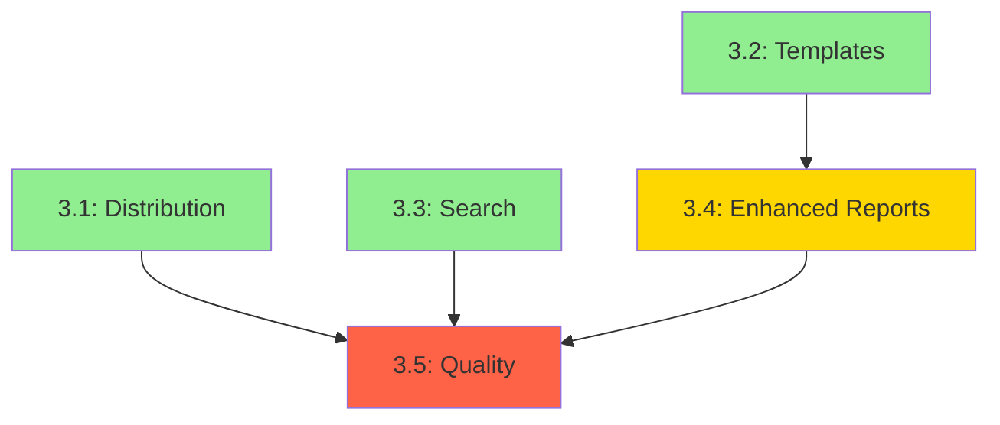

# Phase 3 Plan: Distribution & Polish (v0.3)

**Phase:** 03  
**Name:** Distribution & Polish  
**Version:** v0.3  
**Status:** planning-draft  
**Created:** 2026-03-28

---

## Phase Goals

Based on research in `RESEARCH.md`, this phase will:

1. **Make installation easy** — Binary releases for Windows, macOS, Linux
2. **Add power features** — Full-text search across tasks and logs
3. **Enable customization** — Template system for reports and logs
4. **Harden quality** — Better error messages, benchmarks, extensive testing

---

## Atomic Tasks

### Task 3.1: Distribution Setup (R3.1)

**Goal:** Users can install `tt` via GitHub Releases or `cargo install`

**Subtasks:**
1. Set up GitHub Actions workflow for releases
2. Configure cross-compilation with `cross` crate
3. Create release checklist and versioning strategy
4. Publish to crates.io (if name available)
5. Add installation docs to README

**Acceptance Criteria:**
- [ ] GitHub Actions builds binaries for Windows, macOS, Linux on tag push
- [ ] Release artifacts include `tt` binary + LICENSE + README
- [ ] `cargo install tt` works (if published to crates.io)
- [ ] README includes installation instructions for all methods
- [ ] Version bump script or manual process documented

**Files to create/modify:**
- `.github/workflows/release.yml` (new)
- `Cargo.toml` (update repository URL if needed)
- `README.md` (add installation section)
- `RELEASE.md` (new — release checklist)

**Estimated effort:** 2-3 days

---

### Task 3.2: Template System (R3.2)

**Goal:** Users can customize weekly report and daily log templates

**Subtasks:**
1. Embed default templates in binary using `include_dir`
2. Add template loading logic (filesystem override if exists)
3. Update `tt.toml` config for template paths
4. Create example templates in docs/
5. Add template variables documentation

**Acceptance Criteria:**
- [ ] Default templates embedded in binary
- [ ] Custom templates loaded from `templates/` directory if present
- [ ] Config options in `tt.toml` for template paths
- [ ] All template variables documented
- [ ] Error handling for invalid templates (graceful fallback to embedded)

**Files to create/modify:**
- `src/reports/templates.rs` (new — template loading)
- `src/reports/templates/` (new — embedded templates)
  - `weekly_report.j2`
  - `daily_log.j2`
- `src/models/config.rs` (add template_path fields)
- `docs/templates.md` (new — template guide)

**Dependencies:** None

**Estimated effort:** 1-2 days

---

### Task 3.3: Search + Indexing (R3.3)

**Goal:** Fast full-text search across tasks and logs

**Subtasks:**
1. Add `tantivy` dependency
2. Create search index module
3. Implement `tt search` CLI command
4. Add index building on workspace init
5. Implement incremental index updates
6. Add search filters (--project, --status, --tag, --date-range)

**Acceptance Criteria:**
- [ ] `tt search "query"` returns matching tasks and logs
- [ ] Search results ranked by relevance
- [ ] Filters work: `--project`, `--status`, `--tag`, `--from`, `--to`
- [ ] `--json` output for scripting
- [ ] Index auto-updates on task/log changes
- [ ] Search performance < 200ms for 1000+ files

**Files to create/modify:**
- `src/search/` (new module)
  - `mod.rs`
  - `index.rs` (tantivy index management)
  - `query.rs` (search query builder)
- `src/cli/args.rs` (add Search subcommand)
- `src/cli/commands.rs` (add search implementation)
- `Cargo.toml` (add tantivy dependency)

**Dependencies:** None (can be parallel with Task 3.2)

**Estimated effort:** 3-4 days

---

### Task 3.4: Enhanced Reports (R3.4)

**Goal:** Smarter report generation with better task linking

**Subtasks:**
1. Implement smart task mention merging
2. Improve highlights extraction algorithm
3. Add config options for report sections
4. Add "missing tasks" warnings during log append

**Acceptance Criteria:**
- [ ] Tasks mentioned in logs merged into Done/Doing/Blocked sections
- [ ] Log dates attached to merged task entries
- [ ] Config option to enable/disable sections
- [ ] Config option for max highlights per day
- [ ] Warning when logging to non-existent task ID

**Files to create/modify:**
- `src/reports/weekly.rs` (enhance merging logic)
- `src/reports/highlights.rs` (improve extraction)
- `src/models/config.rs` (add report config options)
- `src/storage/log.rs` (add missing task warning)

**Dependencies:** Task 3.2 (template system)

**Estimated effort:** 1-2 days

---

### Task 3.5: Quality Hardening (R3.5)

**Goal:** Production-ready reliability and performance

**Subtasks:**
1. Improve error messages with suggestions
2. Add `criterion` benchmarks
3. Create realistic test fixtures
4. Add property-based tests with `proptest`
5. Write troubleshooting docs

**Acceptance Criteria:**
- [ ] All error messages include actionable suggestions
- [ ] Benchmarks for key operations (`ls`, `report`, `search`)
- [ ] Performance targets documented and met
- [ ] Test fixtures for large workspace (1000+ tasks)
- [ ] Troubleshooting guide in docs/

**Files to create/modify:**
- `src/error.rs` (enhance error messages)
- `benches/` (new — benchmark suite)
  - `performance.rs`
- `tests/fixtures/` (new — test fixtures)
  - `large_workspace/`
  - `multi_project/`
- `docs/troubleshooting.md` (new)
- `Cargo.toml` (add criterion, proptest dev dependencies)

**Dependencies:** Tasks 3.1, 3.3 (need features complete for benchmarking)

**Estimated effort:** 2-3 days

---

## Task Dependencies



**Execution waves:**
- **Wave 1 (parallel):** Task 3.1, 3.2, 3.3
- **Wave 2:** Task 3.4 (after 3.2)
- **Wave 3:** Task 3.5 (after 3.1, 3.3)

---

## Definition of Done (Phase 03)

- [ ] All 5 tasks complete
- [ ] All acceptance criteria met
- [ ] Benchmarks meet performance targets
- [ ] Documentation complete (README, installation, templates, troubleshooting)
- [ ] GitHub Release v0.3.0 published
- [ ] crates.io published (if name available)
- [ ] CHANGELOG.md updated

---

## Verification Plan

After phase completion, run:

```bash
# Verify installation
cargo install --path .
tt --version

# Verify search
tt search "test"

# Verify templates
tt report week

# Verify benchmarks
cargo bench

# Verify all tests pass
cargo test
```

---

## Risks & Mitigations

| Risk | Likelihood | Impact | Mitigation |
|------|------------|--------|------------|
| crates.io name `tt` taken | High | Medium | Use `tt-cli` or `task-tracker` |
| tantivy binary size too large | Medium | Low | Make optional feature flag |
| Cross-compilation issues | Medium | Medium | Test early on all platforms |
| Search index corruption | Low | High | Add index validation + rebuild command |

---

## Next Steps

1. **Review this plan** — Confirm tasks and acceptance criteria
2. **Run `/gsd:execute-phase 3`** — Start implementation
3. **Track progress** — Update STATE.md as tasks complete

---

## References

- `planning/phases/03-distribution/RESEARCH.md` — Technical research
- `planning/REQUIREMENTS.md` — Phase 3 requirements (R3.1–R3.5)
- `planning/PROJECT.md` — Project vision and tech stack
